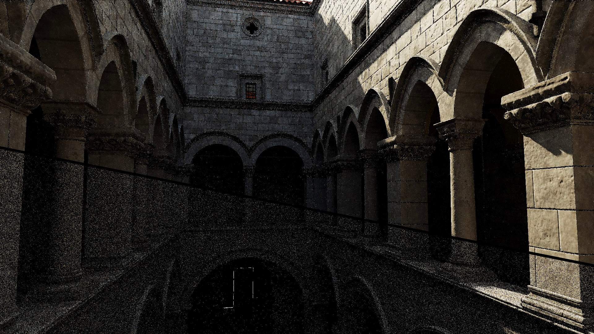
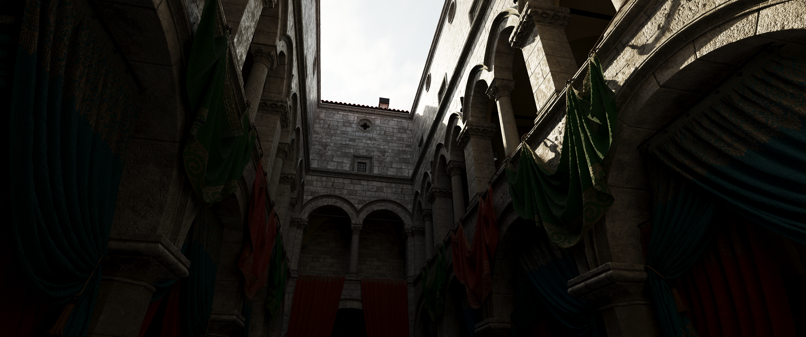
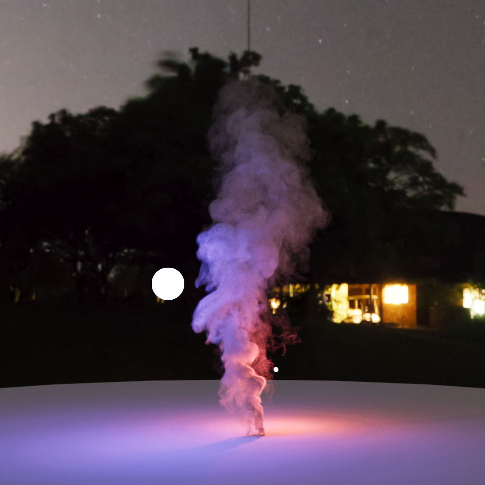

# Novum - Research-Oriented GPU Rendering Engine
### Written in CUDA C++ (and OptiX) by Daniel Qin (danielhqin1127@gmail.com)
*Development: October 2025 – Present*
<br>


<small><i>Specular Dielectric Stanford Dragon rendered using VCM. Notice the caustics, which would be impossible to render using Unidirectional PT.</i></small>
<br>

> **This README is a technical reference.** For the long-form writeups, implementation deep-dives, and the intuitive **[Guide to Advanced GI](https://danielq.org/gi-guide/)**, visit **[danielq.org](https://danielq.org/novum/)**.

Novum is a research-oriented GPU rendering engine built to demonstrate the capabilities of modern global illumination algorithms, both offline and in real time. It supports Vertex Connection and Merging (VCM), Stochastic Progressive Photon Mapping (SPPM), Bidirectional Path Tracing (BDPT), Heterogeneous Volumetric Path Tracing, and Unidirectional Path Tracing with NEE, all running on a fully software BVH. Novum also has a hardware-accelerated real-time **ReSTIR PT (Enhanced)** integrator, running via OptiX, that hits 30–70 fps at 2 megapixels on a laptop RTX 4060.

<details>
  <summary><b>Table of Contents (Click to Toggle)</b></summary>
  <br>

- [Novum - Research-Oriented GPU Rendering Engine](#novum---research-oriented-gpu-rendering-engine)
    - [Written in CUDA C++ (and OptiX) by Daniel Qin (danielhqin1127@gmail.com)](#written-in-cuda-c-and-optix-by-daniel-qin-danielhqin1127gmailcom)
  - [Real-Time: ReSTIR PT (Enhanced)](#real-time-restir-pt-enhanced)
  - [Gallery](#gallery)
  - [Supported Algorithms](#supported-algorithms)
  - [Architecture](#architecture)
  - [Project Structure](#project-structure)
  - [Building \& Running](#building--running)
  - [Learn More](#learn-more)
</details>

## Real-Time: ReSTIR PT (Enhanced)

[](https://www.youtube.com/watch?v=ut58LwZ3ITs)
<small><br><i>Click to watch - Novum's ReSTIR PT (Enhanced) integrator running in real time on a laptop RTX 4060.</i></small>
<br><br>

Novum implements ReSTIR PT Enhanced (2026), running in a separate OptiX branch (`optixBranch/`) built around hardware ray tracing and Shader Execution Reordering (SER). It reaches **30–70 fps at 2MP, with no AI upscaling or frame generation, on a laptop RTX 4060** on bottom-of-the-barrel Ada-generation hardware.

There is a substantial amount of engineering on top of the algorithm itself: a from-scratch hybrid-shift implementation, a 44-byte reservoir (vs. 64 bytes in the reference paper), and an SER-driven stream-compaction strategy that heavily optimizes raygen shaders. The full breakdown lives on the website:

- **[Novum Gets Real-Time: Implementing ReSTIR PT (Enhanced)](https://danielq.org/novum/restir-pt-enhanced/)** - algorithm overview, OptiX/SER integration
- **[Handling the Hybrid Shift](https://danielq.org/novum/hybrid-shift/)** - the core reconnection/shift-mapping logic
- **[Designing Novum's ReSTIR Reservoir](https://danielq.org/novum/reservoir-design/)** - memory layout and packing
- **[SER: The Best Thing Since Sliced Bread](https://danielq.org/novum/ser/)** - why Shader Execution Reordering matters
- **[Light Sampling and the Many-Lights Problem](https://danielq.org/novum/many-lights/)** - light sampling at 10k+ emissive lights
- **[Getting New Sponza to Render in Real Time](https://danielq.org/novum/restir-pt-sponza/)** - GLTF loading, normal maps, tuning for complex scenes
- **[My Opinions on ReSTIR PT (Enhanced)](https://danielq.org/novum/opinions-on-restir/)** - a candid take on where quality and performance actually stand

## Gallery


<small><i>New Sponza (5M+ triangles, GLTF) rendered in real time with ReSTIR PT (Enhanced).</i></small>
<br><br>


<small><i>New Sponza rendered with Unidirectional PT - loaded from GLTF, shaded with a GLTF-style principled BSDF.</i></small>
<br><br>


<small><i>Water caustics rendered with SPPM.</i></small>
<br><br>


<small><i>Heterogeneous Volume Render via NanoVDB, done with delta and ratio tracking.</i></small>
<br><br>


<small><i>Unidirectional render featuring priority-based nested dielectrics - wood modeled with a layered BSDF (microfacet dielectric over a diffuse textured surface), metal modeled with a microfacet metal.</i></small>
<br><br>


<small><i>Unidirectional render featuring a custom leaf material - a layered BSDF with a microfacet dielectric over a transmissive diffuse textured surface, with dew drops.</i></small>
<br><br>


<small><i>Unidirectional render featuring an importance-sampled HDRI for NEE (via a Walker/Vose alias table).</i></small>
<br><br>


<small><i>A VCM render of a physically modeled lightbulb illuminating a glossy gold ring in a rougher steel bowl. The only light source sits behind a thick pane of glass, making the whole scene essentially caustic lighting.</i></small>
<br><br>


<small><i>The same scene rendered in 5 minutes using 4 different algorithms - only VCM fully captures the glossy interreflection (see the red tint in the bowl).</i></small>
<br><br>


<small><i>How different GI algorithms handle a scene dominated by Specular-Diffuse-Specular caustic paths.</i></small>

## Supported Algorithms

| Algorithm | Reference | Notes |
|---|---|---|
| ReSTIR PT (Enhanced) | Lin et al. 2026 | Real time, hardware RT via OptiX + SER (`optixBranch/`) |
| Vertex Connection and Merging (VCM) | Georgiev et al. 2012 | Offline, software BVH |
| Bidirectional Path Tracing (BDPT) | Veach & Guibas 1994 | Offline, software BVH |
| Stochastic Progressive Photon Mapping (SPPM) | Hachisuka & Jensen 2009 | Offline, software BVH |
| Heterogeneous Volumetric Path Tracing | - | nanovdb-backed participating media |
| Unidirectional PT + NEE | - | Offline, software BVH |
| Naive Path Tracing | - | Offline, software BVH |

Also supported: priority-based nested dielectrics, thin-lens depth of field with polygonal bokeh, custom layered BSDFs, and SAH-accelerated BVH scene intersection.

For the theory behind these algorithms - importance sampling, NEE, MIS, and what VCM/BDPT/SPPM are actually doing mathematically - see the **[Novum Guide to Advanced GI](https://danielq.org/gi-guide/)**.

## Architecture

Novum is split into two engines that share the `include/` headers but are otherwise independent:

- **The main engine** (`src/`, root `CMakeLists.txt`) - a fully software-BVH renderer where the offline integrators (VCM, BDPT, SPPM, Unidirectional, Naive) live. Scene setup is entirely host-side: reading the config, building the BVH, and allocating integrator-specific buffers (photon maps, light path vertices, etc.) all happen on the CPU before a single host-side launch kicks off the render kernels.
- **The OptiX branch** (`optixBranch/`, its own `CMakeLists.txt`) - a hardware ray tracing engine built on OptiX, home to ReSTIR PT (Enhanced), and a simple unidirectional path tracer for testing against. This is mainly to facilitate real-time rendering, since hardware raytracing is the only way to get competetive frame rates. Importantly, Novum's OptiX branch uses the same shading system as the main engine. Furthermore, it completely circumvents the traditional recursive model of hardware raytracing and instead emulates ray queries instead, that call OptixTraverse without invoking any closest hit shaders. This means that, **no SBT is used to perform shading**. This was a deliberate choice to optimize ReSTIR PT and other heavy-kernel algorithms, since a context switch to a closest hit shader would be very expensive for such high-live-state kernels. Read more about the decisions **[here](https://danielq.org/novum/restir-pt-enhanced/)**.

Both engines are developed and tested on a laptop RTX 4060 (8 GB VRAM).

## Project Structure

```
Novum/
├── src/            # main engine host + device code (integrators, image I/O, rng)
├── include/         # shared headers used by both engines
├── optixBranch/     # real-time OptiX/SER engine (ReSTIR PT Enhanced), own CMakeLists
├── thirdparty/      # nanovdb, tinygltf, tinyexr, stb_image
├── assets/          # scene data, textures, environment maps, gltf, vdb volumes
├── configs/         # .rendertron scene/render config files
├── tools/           # nanovdb conversion/inspection utilities
└── savedRenders/    # output gallery images referenced in this README
```

## Building & Running

NOTE: For GLTF usage, it is highly recommended to use the texConv tool to pre-compress textures. The engine relies on this to create pre-computed mip levels. Although the engine is built to read images normally with stb image, that pathway is not tested much.

Both engines use CMake (≥ 3.24) and target CUDA architecture 89 (Ada Lovelace, e.g. RTX 40-series) - edit `CMAKE_CUDA_ARCHITECTURES` in the relevant `CMakeLists.txt` if you're on different hardware.

**Main engine:**
```bash
cmake -B build -S .
cmake --build build --config Release
./build/NovumRender configs/config.rendertron
```

**OptiX / ReSTIR PT branch:**

Requires the [OptiX SDK 9.1.0](https://developer.nvidia.com/designworks/optix/download) installed - the default expected path is set at the top of `optixBranch/CMakeLists.txt` and will need updating if yours differs.

```bash
cd optixBranch
cmake -B build -S .
cmake --build build --config Release
./build/renderer_optix configs/sponza.rendertron
```

Both executables take one or more `.rendertron` config paths (relative to the project root) as arguments - example configs live in `configs/`. Novum is developed entirely from the command line; there's no interactive viewport, and renders are written out to image files.

## Learn More

- **[danielq.org/novum](https://danielq.org/novum/)** - project landing page, more demo videos and renders
- **[Guide to Advanced GI](https://danielq.org/gi-guide/)** - intuitive, from-scratch guide to importance sampling, NEE, MIS, BDPT, SPPM, and VCM
- **[Novum Documentation](https://danielq.org/novum/docs/)** - additional implementation notes
- **[Blog](https://danielq.org/posts/)** - general rendering/GPU writing

Questions, or just want to talk path tracing? Discord `_benchmade`, or email danielhqin1127@gmail.com.
